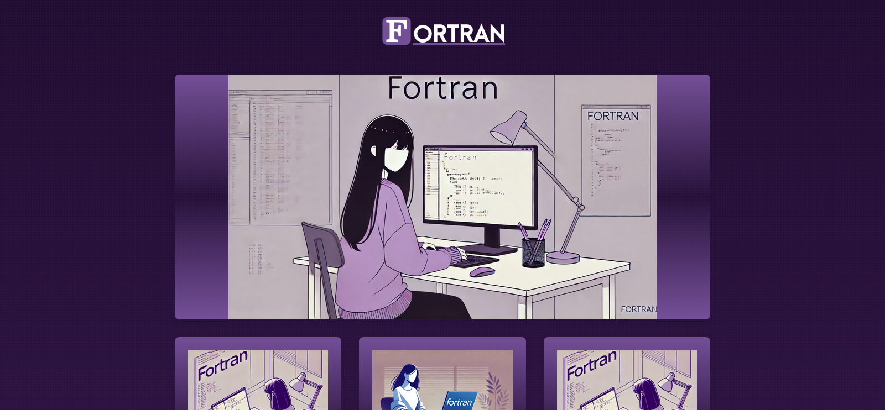

<h1 align="center">
  Projetos Fortran
</h1>

<div align="center">


</div>

## 📖 Descrição

Este website é um catálogo dedicado a projetos desenvolvidos em Fortran, com ênfase em suas aplicações práticas. Projetado com responsividade e intuitividade, oferece uma experiência de navegação fluida e uma organização lógica do conteúdo. Cada projeto é detalhado com exemplos de código e links para recursos complementares, facilitando o estudo e a replicação das soluções apresentadas.

## Sumário

- [Principais Tecnologias](#principais-tecnologias)
- [Página Principal do Projeto](#pagina-principal-do-projeto)
- [Contribuir](#contribuir)
- [Licença](#licenca)

## 💻 Principais Tecnologias

- **Fortran:** Linguagem de programação.
- **HTML, CSS e JavaScript:** Desenvolvimento web.
<div align="center">

## Página Principal do Projeto



</div>

---

<div align="center">
<span style="font-size: 2em">Autor 🧑🛡️</span>
  <table>
  <tr>
    <td align="center">
      <a href="https://github.com/0nF1REy" target="_blank">
        <br>
          <b>Alan Ryan</b>  
      </a>
    </td>
  </tr>
</table>
</div>

## 📫 Contribuir

Se você deseja contribuir com o projeto, siga os seguintes passos:

1. **Faça um fork** do repositório.

2. **Crie uma branch** com a sua funcionalidade:

   ```bash
   git checkout -b feature/minha-funcionalidade
   ```

3. **Faça as alterações necessárias**.

4. **Faça um commit** com suas alterações:

   ```bash
   git commit -m "Adicionado minha funcionalidade"
   ```

5. **Envie para o repositório remoto**:

   ```bash
   git push origin feature/minha-funcionalidade
   ```

6. **Abra um pull request** para a branch `main` do projeto original.

### Documentações úteis

- **<a href="https://www.atlassian.com/br/git/tutorials/making-a-pull-request" target="_blank">📝 Como criar uma solicitação pull</a>**

- **<a href="https://gist.github.com/joshbuchea/6f47e86d2510bce28f8e7f42ae84c716" target="_blank">💾 Padrão de commit</a>**

## 📜 Licença

Este projeto está sob a **licença MIT**. Consulte o arquivo **[LICENSE](LICENSE)** para obter mais detalhes.

> ℹ️ **Aviso de Licença:** © 2025 Alan Ryan da Silva Domingues. Este projeto está licenciado sob os termos da licença MIT. Isso significa que você pode usá-lo, copiá-lo, modificá-lo e distribuí-lo com liberdade, desde que mantenha os avisos de copyright.

⭐ Se este repositório foi útil para você, considere dar uma estrela!
